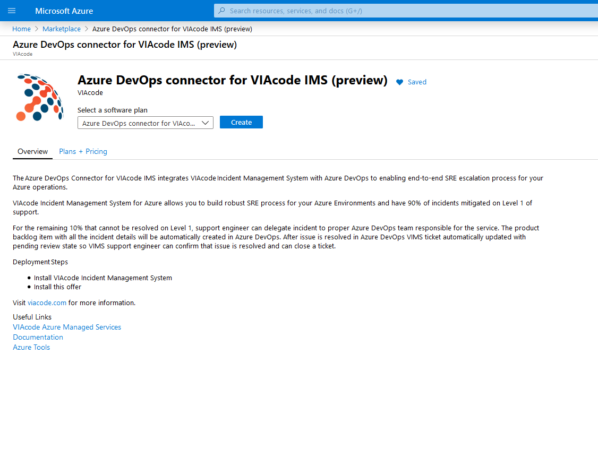
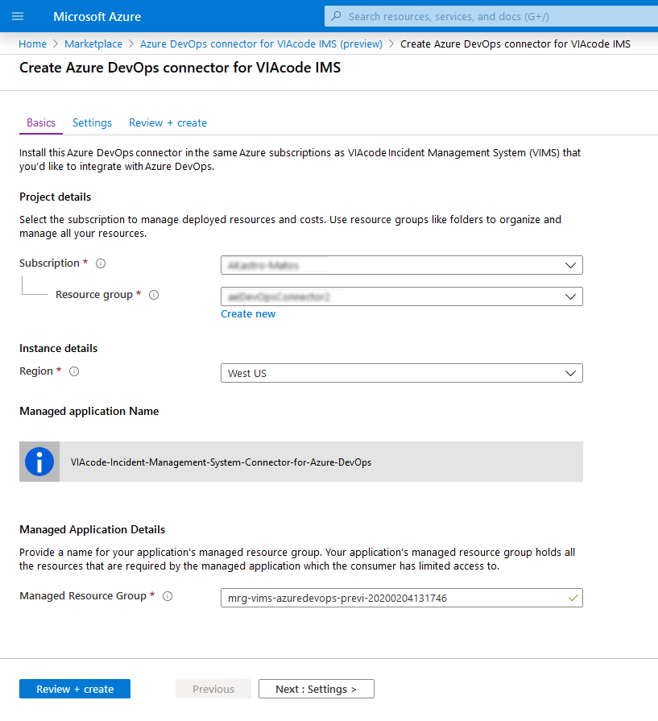
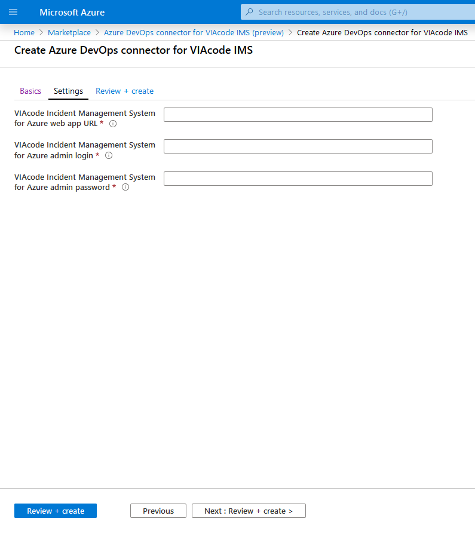
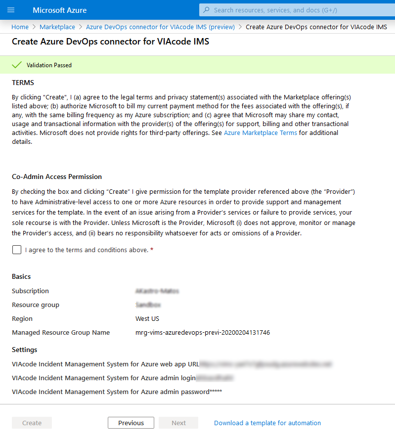
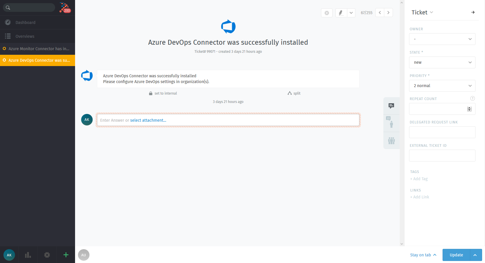
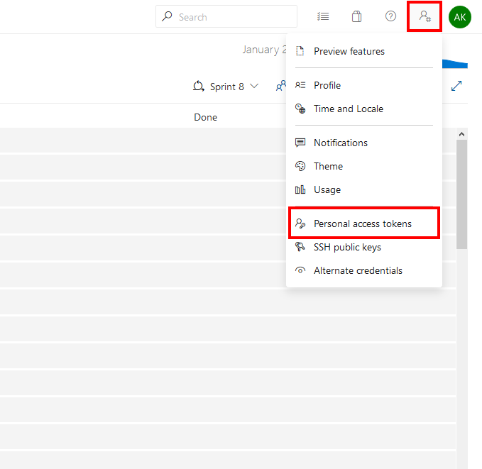
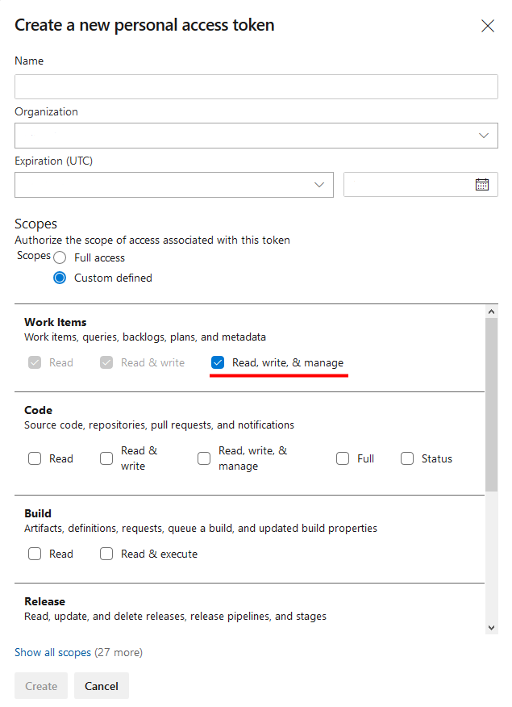
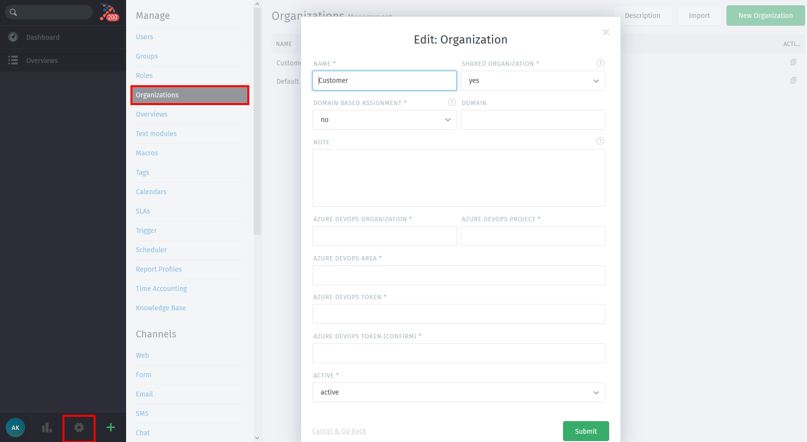
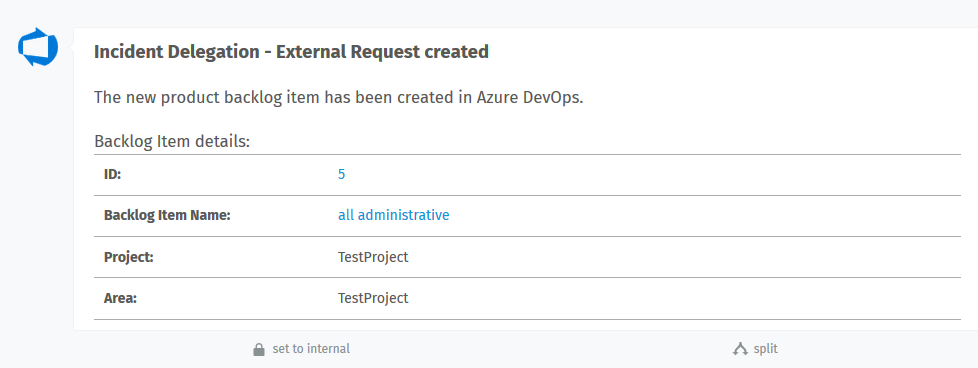

# VIAcode Incident Management System Azure DevOps Connector deployment and configuration guide
<!-- TOC -->
- [Before you begin](#before-you-begin)
- [Deploy from Azure Marketplace](#deploy-from-azure-marketplace)
  - [Plans + Pricing](#plans-+-pricing)

- [Configuration of Azure DevOps connector for VIAcode IMS](#configuration-of-azure-devOps-connector-for-VIAcode-IMS)
  - [Basics](#basics)
  - [Settings](#settings)
  - [Review and create](#review-and-create)

- [Obtaining the Azure DevOps token](#Obtaining-the-Azure-DevOps-token)

- [VIMS organization settings](#VIMS-organization-settings)

<!-- TOC END -->

## Before you begin

Make sure that VIAcode Incident Management System for Azure already installed.
Install this Azure DevOps connector in the same Azure subscriptions as VIAcode Incident Management System (VIMS) that you’d like to integrate with Azure DevOps.

## Deploy from Azure Marketplace

- Navigate to Microsoft Azure Marketplace and find "Azure DevOps connector for VIAcode IMS" offer.

- Make sure that appropriate software plan is selected.
- Press "Create".

### Plans + Pricing

Software plans include two options:

- Azure DevOps Connector – CSP ($0.00 per month)
- Azure DevOps connector for VIAcode IMS ($100.00 per month)

The total cost of running VIAcode Incident Management System on Azure is a combination of the selected software plan and cost of the Azure infrastructure on which you will be running it. The Azure infrastructure cost might vary with regards to the region, type of subscription and other discounts.

## Configuration of Azure DevOps connector for VIAcode IMS

After you have selected appropriate software plan you need to configure the deployment.

### Basics

- Choose a subscription to deploy the management application (Install this Azure DevOps connector in the same Azure subscriptions as VIAcode Incident Management System (VIMS) that you’d like to integrate with Azure DevOps).
- Create a new Resource Group.
- Select a region.
- Provide a name for your application's managed resource group.
- Press "Next : Settings >" button.

### Settings

To enable Azure DevOps Connector you have to specify VIMS Azure web app URL and VIMS admin credentials.

- To get a web app URL please navigate to "VIAcode-Incident-Management-System-for-Azure" managed application and under "Parameters and Otputs" blade copy output for "portalUrl" parameter.

- VIMS for Azure admin login and password should be provided by VIMS administrator.

- Press "Next : Review + create >" button.

### Review and create

- Agree to the terms and conditions.
- Press "Create" button.

If installation of Azure DevOps Connector will be successfull, a new ticket related to this even will be created on VIMS side:

## Obtaining the Azure DevOps token

On DevOps side in up right corner in personal setting please choose "Personal access tokens" option.

Press "New Token" button.

In opened dialog window please fill all the necessary settings:

- Token name
- Token Organization
- Define token expiration date
- Grant token "Read, write, & manage" permissions with work items.
- Press "Create" button

After token will be successfully created make sure you copied the token. **It will not be stored and you will not be able to see it again.**

## VIMS organization settings

Now, when devOps token is obtained, VIMS organization should be configured.

- Click "Cogwheel" in the left bottom corner.
- Click "Organizations".

In opened dialogue windows please fill all "Azure DevOps" related properties:

- Azure DevOps Organization
- Azure DevOps Project
- Azure DevOps Area
- Azure DevOps Token
- Azure DevOps Token (confirm)

Press "Submit" button

If all parts was successfully configured, each time upon delegation a new article will be added to the ticket, which will contain delegation details.

