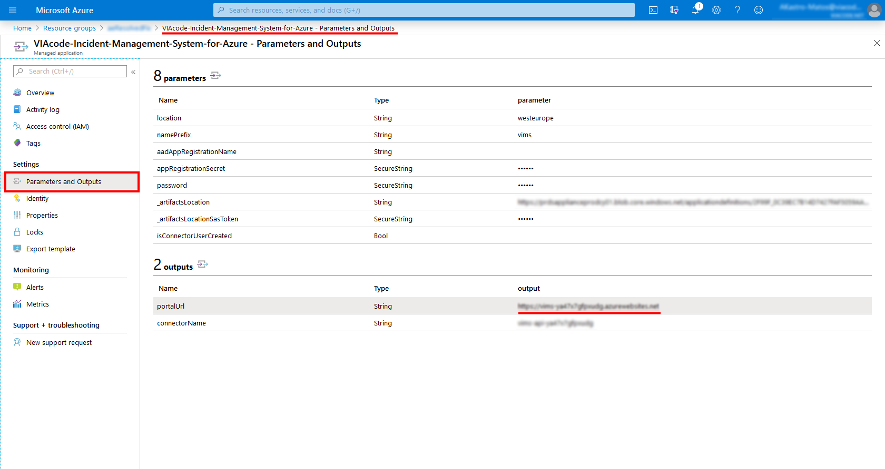
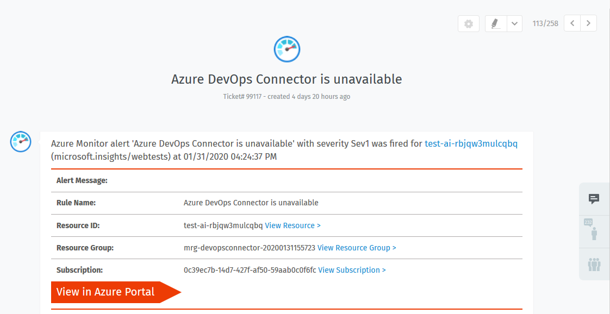
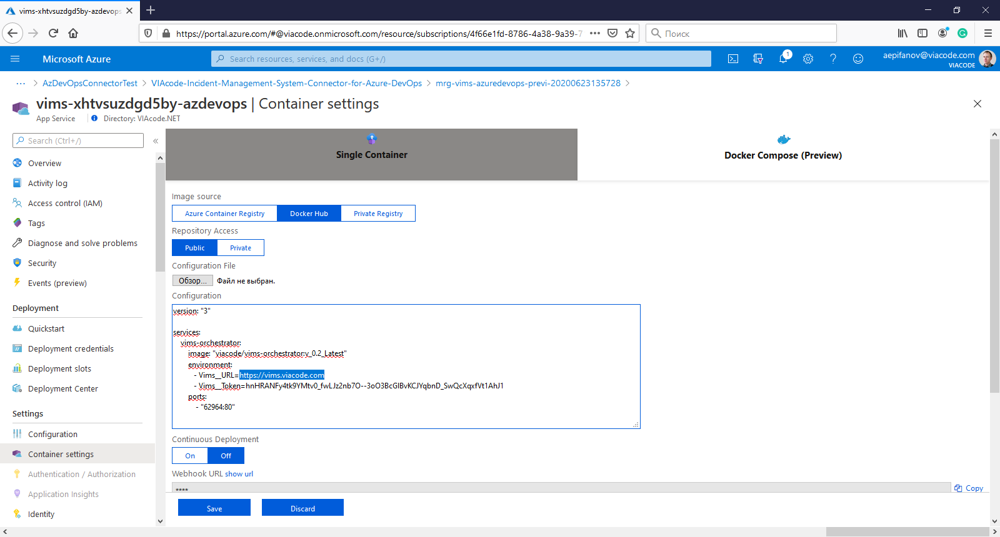
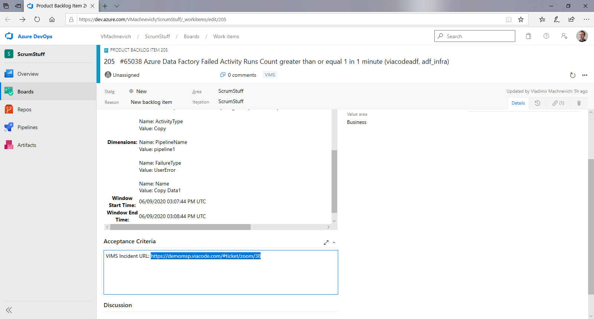

# Azure DevOps connector for VIAcode Incident Management System deployment and configuration guide
<!-- TOC -->
- [Before you begin](#before-you-begin)
- [Deploy from Azure Marketplace](#deploy-from-azure-marketplace)
  - [Plans and Pricing](#plans-and-pricing)

- [Configuration of Azure DevOps connector for VIAcode IMS](#configuration-of-azure-devops-connector-for-viacode-ims)
  - [Basics](#basics)
  - [Settings](#settings)
  - [Review and create](#review-and-create)

- [Obtaining the Azure DevOps token](#obtaining-the-azure-devops-token)
  - [Create Azure DevOps project](#create-azure-devops-project)

- [VIMS organization settings](#vims-organization-settings)

- [Additional information](#additional-information)

- [VIAcode Incident Management System for Azure with custom domain](#viacode-incident-management-system-for-azure-with-custom-domain)

<!-- TOC END -->

## Before you begin
Prerequisite: [VIAcode Incident Management System for Azure](https://azuremarketplace.microsoft.com/en-us/marketplace/apps/viacode_consulting-1089577.viacode-itsm-z?tab=Overview) already installed and configued.
You must install Azure DevOps connector in the same Azure subscriptions as VIAcode Incident Management System (VIMS) that you’d like to integrate with Azure DevOps.

## Deploy from Azure Marketplace

-Navigate to [Microsoft Azure Marketplace](https://azuremarketplace.microsoft.com/) and find ["Azure DevOps connector for VIAcode IMS"](https://azuremarketplace.microsoft.com/en-us/marketplace/apps/viacode_consulting-1089577.vims-azuredevops?tab=Overview) offer.
- Press "Create".

### Plans and Pricing

Currently software plan includes the next option:

- Azure DevOps connector for VIAcode IMS ($100.00 per month)

The total cost of running Azure DevOps connector for VIMS on Azure is a combination of the software plan and cost of the Azure infrastructure on which you will be running it. The Azure infrastructure cost might vary with regards to the region, type of subscription and other discounts.

## Configuration of Azure DevOps connector for VIAcode IMS

After you have selected appropriate software plan you need to configure the deployment.

### Basics

- Choose a subscription to deploy the management application (You must install Azure DevOps connector for VIAcode IMS in the same Azure subscription as VIAcode Incident Management System).
- Create a new Resource Group.
- Select a region.
- Provide a name for your application's managed resource group. Note: you can specify name of management resource group according your naming convention.
- Press "Next : Settings >" button.

### Settings

To enable Azure DevOps Connector for VIAcode IMS you have to specify VIMS Azure web app URL and VIMS admin credentials.

- To get a web app URL please navigate to "VIAcode-Incident-Management-System-for-Azure-DevOps" managed application and under "Parameters and Otputs" blade copy output for "portalUrl" parameter.

- VIMS for Azure admin login and password should be provided by VIMS administrator (make sure that credentials belong to user with 'admin' role in VIMS).
After successful devops connector installation a new system user "Azure DevOps Connector" will be automatically created on VIMS. All delegation related actions will be processed on behalf of this user.

- Press "Next : Review + create >" button.

### Review and create

- Agree to the terms and conditions.
- Press "Create" button.

If installation of Azure DevOps Connector for VIMS is successfull, a new ticket related to this even will be created on VIMS:

To delegate a ticket, select the "Delegate" menu item in the upper right corner of the ticket drop-down menu.
But remember, before the delegation you need to create an Azure DevOps project.

### Create Azure DevOps project ####

Before generating access token, [create Azure DevOps project.](https://docs.microsoft.com/en-us/azure/devops/organizations/projects/create-project?view=azure-devops&tabs=preview-page)

## Obtaining the Azure DevOps token

Please choose "Personal access tokens" option on Azure DevOps personal setting to obtain Azure DevOps token.

Press "New Token" button.

In opened dialog window please complete the following settings:

- Token name
- Token Organization
- Define token expiration date
- Grant token "Read, write, & manage" permissions with work items
Press "Create" button

Make sure you've copied the token. **It is not stored and you will not be able to see it again.**

## VIMS organization settings

Login to VIMS with administrator credentials to configure Azure DevOps settings in the organization. 

- Click "Cogwheel" in the left bottom corner.
- Click "Organizations", edit organization.

Please complete the following "Azure DevOps" properties:

- Azure DevOps Organization (e.g. "VIACode")
- Azure DevOps Project (e.g. "TestProject")
- Azure DevOps Area (e.g. "TestProject")
- Azure DevOps Token - see [Obtaining the Azure DevOps token](#obtaining-the-azure-devops-token)
- Azure DevOps Token (confirm)

Press "Submit" button

## Additional information

If all parts was successfully configured, each time upon delegation a new article will be added to the ticket, which will contain delegation details. Moreover, on each VIMS ticket update, DevOps also will be received related notification:

In case of any issues or Azure DevOps connector unavailability new ticket will be created on VIMS side:

## VIAcode Incident Management System for Azure with custom domain

If you configure custom domain for VIAcode Incident Management System for Azure (VIMS) then you should also configure following in Azure DevOps connector for it:

- Configure custom domain for Azure DevOps connector for VIAcode IMS (Azure DevOps connector) that should be obtained from VIMS custom domain by appending "-azdevops" to top-level domain.
For example if you configured vims.viacode.com custom domain for VIMS then you should configure vims-azdevops.viacode.com custom domain for Azure DevOps connector.
- In order to have links to VIMS tickets with custom domain in Azure DevOps work items' Acceptance Criteria section you should change Vims__URL setting in Azure DevOps connector container settings to URL with VIMS custom domain.

