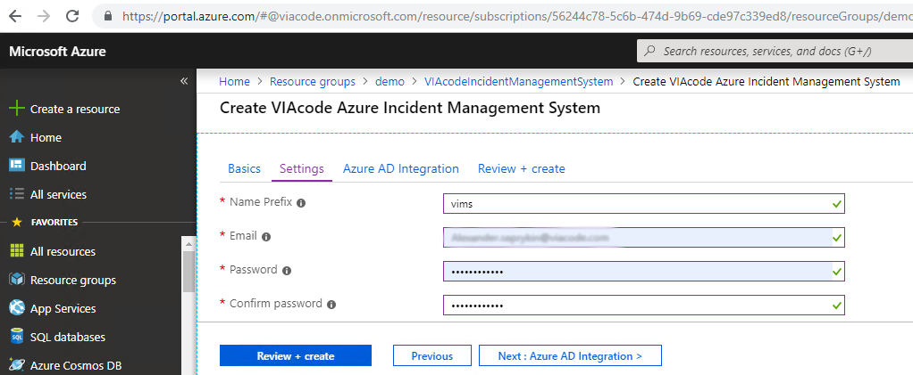
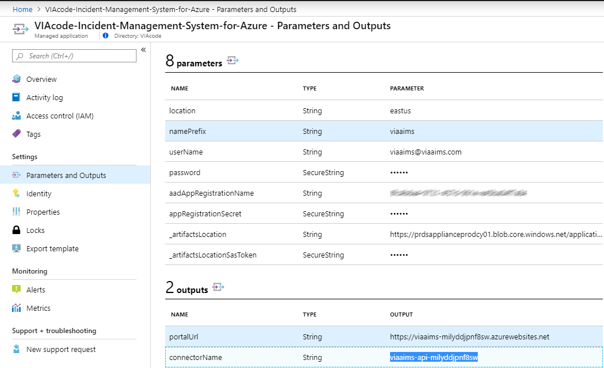

# VIAcode Incident Management System for Azure deployment and configuration guide
<!-- TOC -->
- [Before you begin](#before-you-begin)
  - [Deploy to Azure button](#deploy-to-azure-button)
    - [Pricing](#pricing)

- [Configuration of VIAcode Incident Management System for Azure](#configuration-of-viacode-incident-management-system-for-azure)
  - [Basics](#basics)
  - [Settings](#settings)
  - [Azure AD Integration](#azure-ad-integration)
    - [Purpose of an App registration](#purpose-of-an-app-registration)
  - [Review and create](#review-and-create)
  - [Redirect URI for Azure AD Integration](#redirect-uri-for-azure-ad-integration)
  - [Alert state backward synchronization](#alert-state-backward-synchronization)
    - [Overview](#overview)
    - [How to setup](#how-to-setup)
  - [First Sign in](#first-sign-in)
  - [Email configuration](#email-configuration)
    - [Notes](#notes)
  - [Activity Log Alert message](#activity-log-alert-message)

- [Technical details](#technical-details)
  - [Supported alert types](#supported-alert-types)

- [Additional information](#additional-information)
  - [Steps to create a new App registration in Azure AD](#steps-to-create-a-new-app-registration-in-azure-ad)
  
- [Manual Deployment of VIAcode Incident Management System for Azure](#manual-deployment-of-viacode-incident-management-system-for-azure)  
  - [Get source code](#get-source-code)  
  - [Build solution and prepare package](#Build-solution-and-prepare-package)
  - [Deploy Managed Application Definition](#deploy-managed-application-definition)
  
- [Configuration of VIAcode Alert Connector Premium](#configuration-of-viacode-alert-connector-premium)
  - [Premium Basics](#premium-basics)
  - [Premium Settings](#premium-settings)
  - [Premium Review and create](#premium-review-and-create)
  
<!-- TOC END -->

## Before you begin

Verify that your account user type is not Guest in chosen tenant.

- Sign in to the [Azure portal](https://portal.azure.com/).
- Select "Azure Active Directory", select "Users".


[Guest](https://docs.microsoft.com/en-us/azure/active-directory/b2b/user-properties) accounts have limited permissions. Deployment under a guest account will fail.

## Deploy to Azure button


- To deploy VIAcode Incident Management System for Azure press "Deploy to Azure" button.


- Choose a subscription to deploy Service catalog managed application definition.
- Select a Resource group or crate a new one.
- Select a location.
- Agree to terms and conditions.
- Press "Purchase" button.

### Pricing

The total cost of running VIAcode Incident Management System on Azure is a combination of the selected software plan and cost of the Azure infrastructure on which you will be running it. The Azure infrastructure cost might vary with regards to the region, type of subscription and other discounts.

## Configuration of VIAcode Incident Management System for Azure

When you have Managed App Definition installed run it to create VIAcode Incident Management System for Azure.

## Basics


- Choose a subscription to deploy the management application.
- Create a new Resource Group.
- Select a region.
- Provide a name for your application's managed resource group.
- Press "Next : Settings >" button.

## Settings



- Set a nameprefix for the resources.
- Specify administrator email address for VIAcode Incident Management System for Azure.
- Set password.
- Press "Next : Azure AD Integration >" button.

## Azure AD Integration

To enable Azure AD Integration you have to specify Azure AD Application Registration ID and Secret. To create a new App registration see [Steps to create a new App registration in Azure AD](#steps-to-create-a-new-app-registration-in-azure-ad).


- Either "Enable" Azure AD integration or leave it "Disabled".
- Set Azure AD Application Registration ID.
- Set Secret.
- Press "Next : Review + create >" button.

### Purpose of an App registration

It is used to integrate VIAcode Incident Management System for Azure with Azure AD and Office 365.
Using Azure App, we can generate the token to authenticate the application.
When Azure App is created we can get the Application (client) ID and Secret.
For more information see [Quickstart: Register an application with the Microsoft identity platform.](https://docs.microsoft.com/en-us/azure/active-directory/develop/quickstart-register-app)

## Review and create


- Agree to the terms and conditions.
- Press "Create" button.

## Redirect URI for Azure AD Integration

When deployment finishes (it usually takes up to 15 minutes to complete) you will have to configure redirect URI to enable Azure Active Directory integration.

**Step 1**
In the left-hand navigation pane, select the "Azure Active Directory" service, then select "App registrations" and "[Name of the App registration you used to install VIAcode Incident Management System for Azure]."

**Step 2**
Click on "Redirect URIs" link.


**Step 3**
Configure Redirect URI.

- TYPE - Web.
- REDIRECT URI - `https://[App Service Address]/auth/microsoft_office365/callback`.

Note: The [App Service Address] can be copied from Parameters and Outputs of the installed managed application.


Final string looks like `https://viaaims-milyddjpnf8sw.azurewebsites.net/auth/microsoft_office365/callback`.

- "Save."

## Alert state backward synchronization

### Overview

VIAcode Incident Management System for Azure provides an alert state backward synchronization mechanism. Whenever an incident created based on an Azure alert or closed, the alert is closed automatically.

### How to setup

In order to configure alert state synchronization please assign the VIAcode Incident Management System for Azure Function App Monitoring Contributor Role for your subscription in Azure portal.

- Click on "Subscriptions."
- Select the subscription where VIAcode Incident Management System for Azure is deployed.
- Click "Access control (IAM)."
- "Add" > "Add role assignment."

  - Role: 'Monitoring Contributor'.
  - Assign access to: 'Azure AD user, group, or service principal'.
  - Subscription: Your Subscription.
  - Select: Function app name for VIAcode Incident Management System for Azure.*
  - "Save."

 *(Function app name equals connectorName, can be copied from 'Parameters and Outputs' of the installed managed application)
    

You can also execute the following PS script:

```powershell
New-AzRoleAssignment -ObjectId (Get-AzADServicePrincipal -SearchString '{CONNECTOR_NAME}').Id -RoleDefinitionName 'Monitoring Contributor' -Scope '/subscriptions/{SUBSCRIPTION_ID}';
```

SUBSCRIPTION_ID - ID of a monitored subscription.  
CONNECTOR_NAME - The CONNECTOR_NAME can be copied from 'Parameters and Outputs' of the installed managed application.

If you have multiple subscriptions, execute the script for each of them.

## First Sign in


- Open VIAcode Incident Management System for Azure dashboard and click on the link to get to the system.


- Sign in using credentials you entered for VIAcode Incident Management System for Azure administrator.

## Email configuration

When you Log in to VIAcode Incident Management System for Azure as administrator please configure email notification.


- Click "Cogwheel" in the lest bottom corner.
- Click "Email" in Channels section.
- Click "Settings".
- Enter sender name and email in angle brackets in Notification Sender section like it is shown in the screenshot.
- Click "Submit".


- Click "Accounts".
- Click "Edit" in Email Notification section.
- Select "SMTP - configure your own outgoing SMTP settings" in Send Mails via.
- Fill Host with `outlook.office365.com` for office 365 accounts.
- Fill User with the account you will you use for email notification.
- Fill Password.
- Default port for SMTP is 587.
- Click "Continue" button.


- Click "New" button in Email Accounts section.
- Fill Organization & Department Name.
- Fill Email with the account you will you use for email notification.
- Select "Users" in Destination Group.
- Click "Experts" link.


- Select "IMAP" Type.
- Fill Host with `outlook.office365.com` for office 365 accounts.
- Fill User with the account you will you use for email notification.
- Fill Password.
- Default port for IMAP is 993.
- Click "Continue" button.


- Check settings.
- Default port for SMTP is 587.
- Click "Continue" button.

### Notes

Email configuration is required for enabling following functionality:

- Send system account notifications - signup, password reset, password change.
- Register incoming emails as tickets (incoming mail).
- Send notifications about new tickets to the agents, send reminders.
- Use triggers to inform clients about ticket creation, status changes.
- Agent communication with clients by email (using built in web or regular mail client).

It is important to note that after deployment, by default, email profiles are not created. Client has to set up email for VIAcode Incident Management System for Azure manually.

In general, VIAcode Incident Management System for Azure best practice is to create new dedicated empty mail account in company mail system. VIAcode Incident Management System for Azure usually can auto-detect settings, so nothing apart email and password is required.

- Google blocks access to the email from non-google devices by default, so you have to adjust security settings.
- Do not add your work email, VIAcode Incident Management System for Azure will register all emails there and send notification response to each.
- Do not use shared mailbox in Office 365, VIAcode Incident Management System for Azure can not log into it.
- Do not use mailbox that forwards mails, VIAcode Incident Management System for Azure will be unable to read its own test email.

For current email set up documentation see [e-mail](https://zammad-admin-documentation.readthedocs.io/en/latest/channels-email.html).

## Activity Log Alert message

At the time of this writing description didn't work for Activity Log Alerts in Azure.
Because of this alert message hasn't been filled for tickets created from Activity Log Alerts.
Workaround that fills alert message for tickets created from Activity Log Alerts has been implemented.
Alert message is obtained from corresponding alert rule's description.
However to get it up and working you need to assign at least Reader role to connector function app.

In order to do so:

- Click on "Subscriptions."
- Select the subscription where VIAcode Incident Management System for Azure is deployed.
- Click "Access control (IAM)."
- "Add" > "Add role assignment."

  - Role: 'Reader'.
  - Assign access to: 'Function App'.
  - Subscription: Your Subscription.
  - Select: Function app name for VIAcode Incident Management System for Azure.*
  - "Save."

 *(Function app name equals connectorName, can be copied from 'Parameters and Outputs' of the installed managed application)
    

You can also execute the following PS script:

```powershell
New-AzRoleAssignment -ObjectId (Get-AzADServicePrincipal -SearchString '{CONNECTOR_NAME}').Id -RoleDefinitionName Reader -Scope '/subscriptions/{SUBSCRIPTION_ID}';
```

SUBSCRIPTION_ID - ID of a monitored subscription.  
CONNECTOR_NAME - The CONNECTOR_NAME can be copied from 'Parameters and Outputs' of the installed managed application.

If you have multiple subscriptions, execute the script for each of them.

## Technical details

### Supported alert types

VIAcode Incident Management System for Azure can process the following Azure alert types:

- Metric Alerts

  - Platform

- Log Alerts

  - Log Analytics
  - Application Insights

- Activity Log Alerts

  - Activity Log - Administrative
  - Activity Log - Policy
  - Activity Log - Autoscale
  - Activity Log - Security
  - Service Health

Please be informed, that alerts generated by Azure Cost Management currently are not supported.

## Additional information

## Steps to create a new App registration in Azure AD

Follow the below-listed steps to register the application.

**Step 1**
Log in to the Azure portal using your Azure account.
URL - <https://portal.azure.com/>.

**Step 2**
In the left-hand navigation pane, select the "Azure Active Directory" service, and then select" App registrations" > "New registration."

**Step 3**
When the Register an application page appears, enter your application's registration information:

- Name: Enter a meaningful application name that will be displayed to users of the app. (VIAcode Incident Management System for Azure.)
- Supported account types: Select which accounts you would like your application to support. (Accounts in any organizational directory (Any Azure AD directory - Multitenant) and personal Microsoft accounts (e.g. Skype, Xbox)).
- Redirect URI (optional): Leave it for now. It should be specified later when the managed application is installed.
- "Register."

**Step 4**
In the menu blade select "Certificates & secrets" > "New client secret."

**Step 5**
When the Add a client secret page appears, specify Description and Expiration period.

**Step 6**
Copy the secret to clipboard.
Use it as Secret in Create VIAcode Incident Management System for Azure wizard.


**Step 7**
Navigate to the overview of the App registration and copy Application (client) ID.  
Use it as Azure AD Application Registration ID in Create VIAcode Incident Management System for Azure wizard.

&#32;ID.png)

**Step 8**
Configure App registration authentication.

Go to Authentication blade.
Switch the radio button under 'Supported account types' to Multitenant:


## Manual Deployment of VIAcode Incident Management System for Azure

Please follow the instructions below to deploy VIAcode Incident Management System for Azure (VIMS) manually, if for some reasons Deploy to Azure button is not for you.

## Get source code

Download or clone VIAcode-Incident-Management-System-for-Azure repository.

## Build solution and prepare package

VIAcode Incident Management System for Azure solution contains functions apps that should be built. You need Visual Studio 2017 version 15.4 or later with .Net Core SDK and Azure Development Tools for Visual Studio installed.

Copy this script to new .ps1 file and Run from VIAcode-Incident-Management-System-for-Azure project folder to get the package:

```powershell
$scriptDir = Split-Path -Parent $MyInvocation.MyCommand.Path

# Build ResourceProvider
cd .\ResourceProvider
dotnet restore
dotnet build -c Release
cd ..

# Create Archive Itsmapi.zip
$Itsmapi = ".\Itsmapi.zip"

Compress-Archive -Path "$scriptDir\ResourceProvider\ItsmAPI\bin\Release\netcoreapp2.1\*" `
-DestinationPath $Itsmapi -Force

# Build DashboardReport
cd .\DashboardReport
dotnet restore
dotnet build -c Release
cd ..

# Create Archive slareports.zip
$slareports = ".\slareports.zip"

Compress-Archive -Path "$scriptDir\DashboardReport\DashboardReport\bin\Release\netcoreapp2.1\*" `
-DestinationPath $slareports -Force

# Build ITSMConnector
cd .\ITSMConnector
dotnet restore
dotnet build -c Release
cd ..

# Create Archive zammadconnector.zip
$zammadconnector = ".\zammadconnector.zip"
Compress-Archive -Path "$scriptDir\ITSMConnector\ITSMConnector\bin\Release\netcoreapp2.1\*" `
-DestinationPath $zammadconnector -Force

# Create package itsm-z-free.zip
$itsmzfree = ".\itsm-z-free.zip"

Compress-Archive -Path "$scriptDir\Zammad\AppService\*" -DestinationPath $itsmzfree -Force

Compress-Archive -Path $Itsmapi -DestinationPath $itsmzfree -Update
Compress-Archive -Path $slareports -DestinationPath $itsmzfree -Update
Compress-Archive -Path $zammadconnector -DestinationPath $itsmzfree -Update
```

## Deploy Managed Application Definition

Upload the package into an Azure blob or another accessible location.

Execute the script below after filling [parameters] to deploy Service catalog managed application definition.

```powershell
# Get Storage account where itsm-z-free.zip is stored in an Azure blob
$storageAccount = Get-AzStorageAccount -ResourceGroupName "[RG name]" -Name "[Storage account]"

# Get Context of the Storage Account
$ctx = $storageAccount.Context

# Get the blob with itsm-z-free.zip
$blob = Get-AzStorageBlob -Container "[Container Name]" -Blob "[itsm-z-free.zip]" -Context $ctx

#Get owner ID
$ownerID=(Get-AzRoleDefinition -Name Owner).Id

#Get user ID
$userId = (Get-AzADUser -UserPrincipalName '[User principal name]').Id

#Get contributor ID
$contributorID=(Get-AzRoleDefinition -Name Contributor).Id

#Get AD Service Principal ID by name
$appId = (Get-AzADServicePrincipal -ServicePrincipalName 'a0778614-7329-40be-a67b-e51cd7dd03b0').Id

#Get user ID
New-AzManagedApplicationDefinition `
  -Name "VIAcode-Incident-Management-System-for-Azure" `
  -Location "Central US" `
  -ResourceGroupName "VIMS" `
  -LockLevel ReadOnly `
  -DisplayName "VIMS" `
  -Description "VIMS" `
  -Authorization "${userId}:$ownerID","${appId}:$contributorID" `
  -PackageFileUri $blob.ICloudBlob.StorageUri.PrimaryUri.AbsoluteUri  
```

## Configuration of VIAcode Alert Connector Premium

Find VIAcode Incident Management System for Azure app in Azure Marketplace and click "GET IT NOW".

## Premium Basics


- Choose a subscription to deploy the managed application.
- Create a new Resource Group.
- Select a region.
- Provide a name for your application's managed resource group.
- Press "Next : Settings >" button.

## Premium Settings


- Specify id of a subscription where VIAcode Incident Management System for Azure to which you want to connect selected subscription is deployed to.
- Specify name of a managed resource group of that VIAcode Incident Management System for Azure.
- Specify name of a connector function app of that VIAcode Incident Management System for Azure.
You can find it in output of a corresponding managed application under name connectorName:
    
- Press "Next : Review + create >" button.

## Premium Review and create


- Agree to the terms and conditions.
- Press "Create" button.