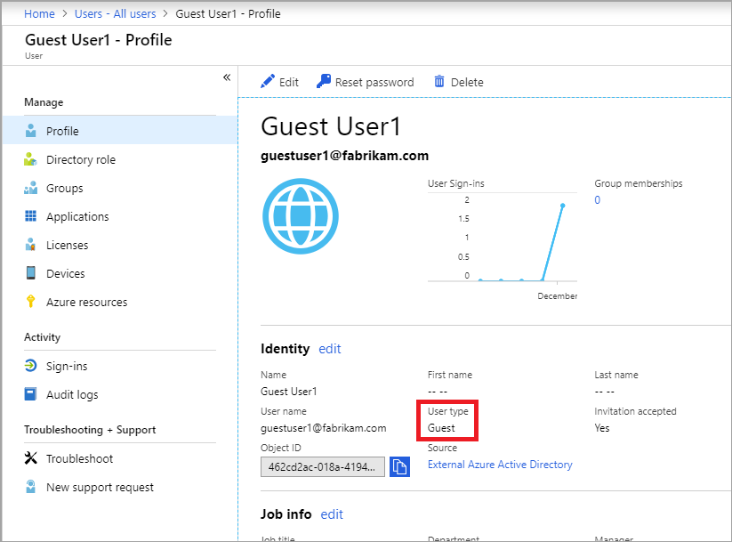
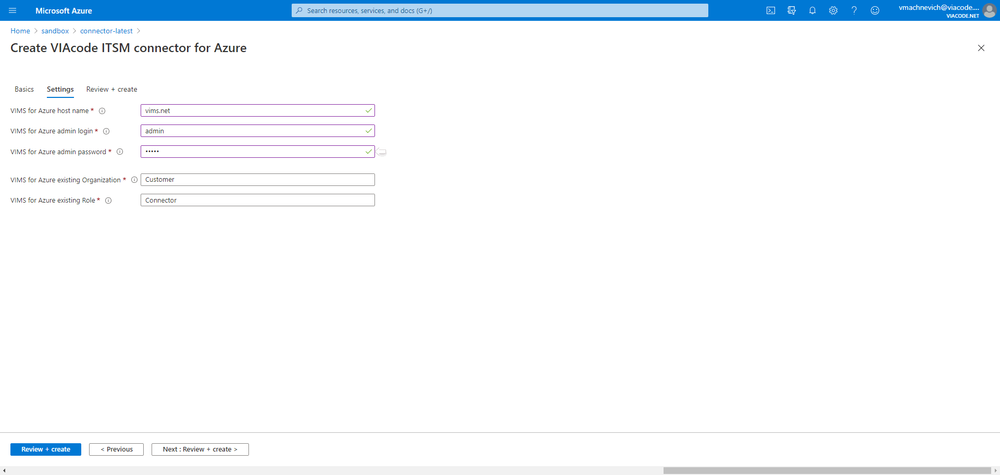

# VIAcode ITSM connector for Azure deployment and configuration guide
<!-- TOC -->
- [Before you begin](#before-you-begin)
  - [Deploy from Azure Marketplace](#deploy-from-azure-marketplace)
    - [Pricing](#pricing)

- [Configuration of VIAcode ITSM connector for Azure](#configuration-of-viacode-itsm-connector-for-azure)
  - [Basics](#basics)
  - [Settings](#settings)
  - [Review and create](#review-and-create)
  - [Alert state backward synchronization](#alert-state-backward-synchronization)
    - [Overview](#overview)
    - [How to setup](#how-to-setup)
  
- [Technical details](#technical-details)
  - [Supported alert types](#supported-alert-types)
<!-- TOC END -->

## Before you begin

Verify that your account user type is not Guest in the chosen tenant.

- Sign in to the [Azure Portal](https://portal.azure.com/).
- Select "Azure Active Directory", select "Users".

[Guest](https://docs.microsoft.com/azure/active-directory/b2b/user-properties) accounts have limited permissions. Deployment under a guest account will fail.

## Deploy from Azure Marketplace

- [Navigate](https://azuremarketplace.microsoft.com/en-us/marketplace/apps/viacode_consulting-1089577.viacode-itsm-connector-for-azure) to Microsoft Azure Marketplace and find "VIAcode ITSM connector for Azure" offer.

- Press "Get it now" button.
- Press "Continue".

You will be taken to Azure Portal to complete installation:

- Press "Create".

### Pricing

The total cost of running VIAcode ITSM connector for Azure is a combination of the selected software plan and cost of the Azure infrastructure on which you will be running it. The Azure infrastructure cost might vary with regards to the region, type of subscription and other discounts.

## Configuration of VIAcode ITSM connector for Azure

After you have selected "VIAcode ITSM connector for Azure" software plan you need to configure it.

## Basics

- Choose a subscription to deploy the management application.
- Create a new Resource Group.
- Select a region.
- Provide a name for your application's managed resource group.
- Press "Next : Settings >" button.

## Settings

You have to specify VIAcode Incident Management System hostname (FQDN) and administrator user credentials.

- Set VIAcode Incident Management System hostname.
- Set admin user login.
- Set admin user password.
- Press "Next : Review + create >" button.

## Review and create

- Agree to the terms and conditions.
- Press "Create" button.

## Alert state backward synchronization

### Overview

VIAcode ITSM connector for Azure provides an alert state backward synchronization mechanism. It enables automatic state synchronization of the VIMS incidents and Azure Alerts.

### How to setup

In order to configure alert state synchronization please provide VIAcode ITSM connector for Azure Managed App with Contributor Role for subscription VIAcode ITSM connector for Azure is deployed to in Azure Portal.

- Click on the installed managed application.
- Select 'Application Permissions (preview)' blade.

- Click "Add."

  - Select 'Contributor' role.
  - Select your subscription.
  - "OK."

## Technical details

### Supported alert types

VIAcode ITSM connector for Azure can process the following Azure alert types:

- Metric Alerts

  - Platform

- Log Alerts

  - Log Analytics
  - Application Insights

- Activity Log Alerts

  - Activity Log - Administrative
  - Activity Log - Policy
  - Activity Log - Autoscale
  - Activity Log - Security
  - Service Health
  - Resource Health
  
- Security Center Alerts

- Budget alerts (Cost alerts)