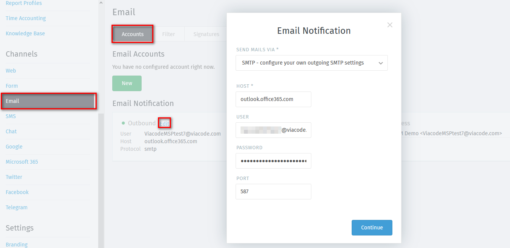
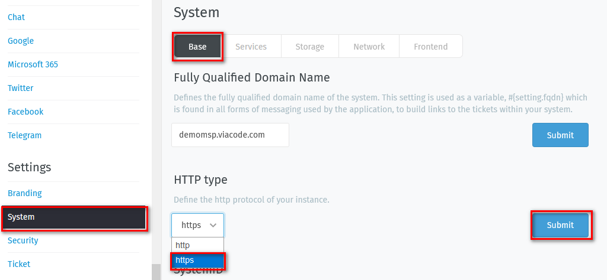
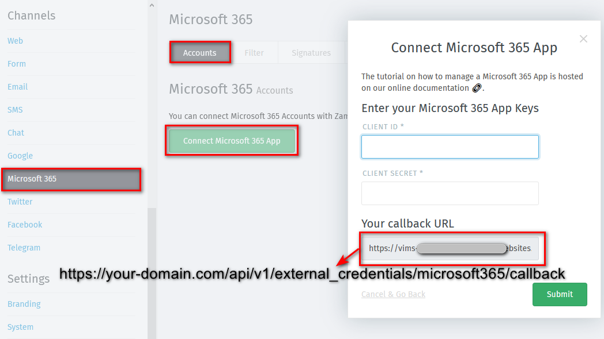
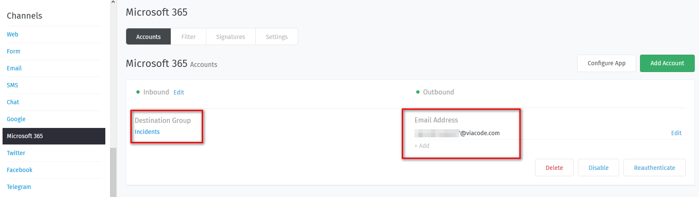
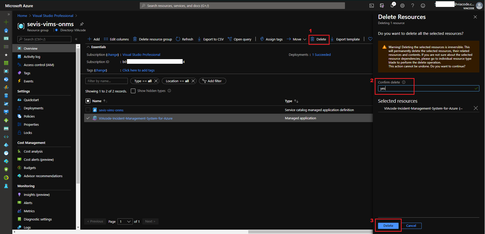

# VIAcode Incident Management System for Azure deployment and configuration guide
<!-- TOC -->
- [Before you begin](#before-you-begin)
  - [Deploy from Azure Marketplace](#deploy-from-azure-marketplace)
    - [Pricing](#pricing)
- [Configuration of VIAcode Incident Management System for Azure](#configuration-of-viacode-incident-management-system-for-azure)
  - [Basics](#basics)
  - [Settings](#settings)
  - [Review and create](#review-and-create)
  - [First Sign in](#first-sign-in)
  - [Redirect URI for Azure AD Integration](#redirect-uri-for-azure-ad-integration)
  - [Email configuration](#email-configuration)
    - [Notification sender](#Notification-sender)
    - [Outbound notification](#Outbound-notification)
    - [Microsoft 365 channel configuration](Microsoft-365-channel-configuration)
    - [Email notification notes](#Email-notification-notes)
- [Enable Azure AD Integration with Office 365 after installation](#Enable-Azure-AD-Integration-with-Office-365-after-installation)
  - [Enable https in Settings](#Enable-https-in-Settings)
  - [Create a new App registration in Azure AD](#Create-a-new-App-registration-in-Azure-AD)
  - [Enable Office 365 Authentication](#Enable-Office-365-Authentication)
- [Uninstallation of VIAcode Incident Management System for Azure](#uninstallation-of-viacode-incident-management-system-for-azure)
  - [Deletion Notes](#deletion-notes)
  - [Steps to Remove Application and Managed Resource Group](#steps-to-remove-application-and-managed-resource-group)
  <!-- TOC END -->

## Before you begin

Verify that your account user type is not Guest in the chosen tenant.

- Sign in to the [Azure Portal](https://portal.azure.com/).
- Select "Azure Active Directory", select "Users".

[Guest](https://docs.microsoft.com/azure/active-directory/b2b/user-properties) accounts have limited permissions. Deployment under a guest account will fail.

## Deploy from Azure Marketplace

- [Navigate](https://azuremarketplace.microsoft.com/en-us/marketplace/apps/viacode_consulting-1089577.viacode-itsm-z) to Microsoft Azure Marketplace and find "VIAcode Incident Management System for Azure" offer.

- Press "Get it now" button.
- Select "VIAcode Incident Management System for Azure" software plan and press "Continue".

You will be taken to Azure Portal to complete installation:

- Make sure "VIAcode Incident Management System for Azure" software plan is selected.
- Press "Create".

### Pricing

The total cost of running VIAcode Incident Management System on Azure is a combination of the selected software plan and cost of the Azure infrastructure on which you will be running it. The Azure infrastructure cost might vary with regards to the region, type of subscription and other discounts.

## Configuration of VIAcode Incident Management System for Azure

After you have selected "VIAcode Incident Management System for Azure" software plan you need to configure it.

## Basics

- Choose a subscription to deploy the managed application.
- Create a new Resource Group.
- Select a region.
- Provide a name for your application's managed resource group.
- Press "Next : Settings >" button.

## Settings

- "Enable" Azure AD integration or leave it "Disabled".
To enable Azure AD Integration you have to specify Azure AD Application Registration ID and Secret.  How create a new App registration see [Create a new App registration in Azure AD](#Create-a-new-App-registration-in-Azure-AD).
- For "Enabled" scenario set Azure AD Application Registration ID and  Secret.
- For "Disabled" scenario continue installation with default settings. 
- Press "Next : Review + create >" button.

## Review and create

- Agree to the terms and conditions.
- Press "Create" button.

## First Sign in

- Open VIAcode Incident Management System for Azure dashboard and click on the link to get to the system.

### Login to VIMS

Read this section if you installed VIMS with AAD Integration "Disabled" option. 

- USERNAME / EMAIL - admin.
- Password - admin.
- "Sign in".

Note: By default VIMS administrator has admin/admin credentials. Please, do not forget to change them after your first Sign in.

## Redirect URI for Azure AD Integration

Read this section if you installed VIMS with AAD Integration "Enabled" option. 
After VIMS installation you will have to configure redirect URI to enable Azure Active Directory integration.

**Step 1** In the left-hand navigation pane, select the "Azure Active Directory" service, then select "App registrations" and "Name of the App registration" you used to install VIAcode Incident Management System for Azure.

**Step 2** Click on "Redirect URIs" link.

**Step 3**
Configure Redirect URI.

- TYPE - Web.
- REDIRECT URI - https://your-domain.com/auth/microsoft_office365/callback.

Note: The  ``your-domain.com``can be copied from Parameters and Outputs of the installed managed application.

Final string looks like `https:/vims-nktbyzg56jxak.azurewebsites.net/auth/microsoft_office365/callback`.

- Click on "Register."

## Email configuration
When you Log in to VIAcode Incident Management System for Azure as administrator please configure email notification. 
Next steps will show how configure email notification for account. 

### Notification sender 
Define notification sender email address. 
Note that Microsoft 365 account needs to have Exchange license to be able send and receive messages. 

- Click "Gear" at the left bottom corner.
- Click "Email" in Channels section.
- Click "Settings".
- Enter sender name and email in angle brackets in "Notification Sender" section like it is shown in the screenshot below.
- Click "Submit".

### Outbound notification
Configure Outbound notification on  issues that were raised by external sources. For example,  incidents and recommendations from [ITSM Connector for Azure]( https://azuremarketplace.microsoft.com/en-us/marketplace/apps/viacode_consulting-1089577.viacode-itsm-connector-for-azure?tab=Overview).

- Click "Accounts".
- Click "Edit" in Email Notification section.
- Select "SMTP - configure your own outgoing SMTP settings" in Send Mails via.
- Fill Host with `outlook.office365.com` for office 365 accounts.
- Fill User with the account you will you use for email notification.
- Fill Password.
- Default port for SMTP is 587.
- Click "Continue" button.

### Microsoft 365 channel configuration
It is possible receive incidents raised by customers using direct email messages to the 'Notification sender's' email address. Each email message to this account will create new ticket in VIMS. 
Below described configuration flow for Microsoft 365 channel. 

#### Enable https in Settings
- Open VIMS admin panel
- Select "Gear" at the left bottom corner
- Go to  "Settings-System-Base-HTTP type"
- Select "https"
- Click "Submit"

#### Copy Callback URL in Microsoft 365 

- Open VIMS admin panel

- Go to  "Channels-Microsoft 365- Accounts- Connect Microsoft 365 App"

- Copy "Your callback URL" field 

- It will have the following format:`` https://your-domain.com/api/v1/external_credentials/microsoft365/callback``

  

#### Create Application in AAD

Create application in Azure Active Directory of notification email account's tenant. For example, for viacode.com email account we need create application in AAD for viacode.com tenant. 

Follow application configuration process described in [Zammad documentation](https://admin-docs.zammad.org/en/latest/channels/microsoft365/accounts/register-app.html#step-by-step). 

#### Connect Microsoft 365 app with VIMS

-  Follow steps  [how connect to O365 account in Zammad documentation](https://admin-docs.zammad.org/en/latest/channels/microsoft365/accounts/account-setup.html#add-a-new-account ). 
- Click "Add account" to authenticate in Azure 
- Select "Incidents" as a Destination Group

Congratulations! Now all incoming messages will be converted into incidents in your ticketing system.

### Email notification notes

Email configuration is required for enabling following functionality:

- Send system account notifications - signup, password reset, password change.
- Register incoming emails as tickets (incoming mail).
- Send notifications about new tickets to the agents, send reminders.
- Use triggers to inform clients about ticket creation, status changes.
- Agent communication with clients by email (using built in web or regular mail client).

It is important to note that after deployment, by default, email profiles are not created. Client has to set up email for VIAcode Incident Management System for Azure manually.

In general, VIAcode Incident Management System for Azure best practice is to create new dedicated empty mail account in company mail system. VIAcode Incident Management System for Azure usually can auto-detect settings, so nothing apart email and password is required.

- Google blocks access to the email from non-google devices by default, so you have to adjust security settings.
- Do not add your work email, VIAcode Incident Management System for Azure will register all emails there and send notification response to each.
- Do not use shared mailbox in Office 365, VIAcode Incident Management System for Azure can not log into it.
- Do not use mailbox that forwards mails, VIAcode Incident Management System for Azure will be unable to read its own test email.

For current email set up documentation see [e-mail](https://zammad-admin-documentation.readthedocs.io/en/latest/channels-email.html).

## Enable Azure AD Integration with Office 365 after installation
This section allows enable authentication to VIMS using Office 365 email account or, in other words, enable Azure AD Integration.  

### Enable https in Settings

- Open VIMS admin panel
- Go to  "Settings-System-Base-HTTP type"
- Select "https"
- Click "Submit"

### Create a new App registration in Azure AD

App registrations is used to integrate VIAcode Incident Management System for Azure with Azure AD and Office 365. Using Azure App, we can generate the token to authenticate the application. When Azure App is created we can get the Application (client) ID and Secret.

Follow the below-listed steps to register the application. 

Please note, to enable Office 365 authentication you cannot use ClientID and Secret of application that was created for   Microsoft 365 email channel notification.  You need create different application with different name and settings. 

**Step 1**
Log in to the Azure Portal using your Azure account.
URL - <https://portal.azure.com/>.

**Step 2**
In the left-hand navigation pane, select the "Azure Active Directory" service, and then select" App registrations" > "New registration."

**Step 3**
When the Register an application page appears, enter your application's registration information:

- Name: Enter a meaningful application name that will be displayed to users of the app. (VIAcode Incident Management System for Azure.)

- Supported account types: Select which accounts you would like your application to support.

  Suggested: *Accounts in any organizational directory (Any Azure AD directory - Multitenant) and personal Microsoft accounts (e.g. Skype, Xbox))*.

- "Register"

**Step 4**
In the menu blade select "Certificates & secrets" > "New client secret."

**Step 5**
When the Add a client secret page appears, specify Description and Expiration period.

**Step 6**
Copy the secret to clipboard.
Use it as Secret in Create VIAcode Incident Management System for Azure wizard.

**Step 7**
Navigate to the overview of the App registration and copy Application (client) ID.  
Use it as Azure AD Application Registration ID in Create VIAcode Incident Management System for Azure wizard.

**Step 8**

- After application created go to "Authentication" section of app on left panel
- Switch the radio button under 'Supported account types' to Multitenant. 
- Redirect URI(optional) Web. Specify your domain name. Is should have the following format: ``https://your-domain.com/auth/microsoft_office365/callback`` .
- Front-channel logout URL. Specify your domain name. should have following format: ``https://your-domain.com/logout``

For more information see [Quickstart: Register an application with the Microsoft identity platform.](https://docs.microsoft.com/azure/active-directory/develop/quickstart-register-app)

### Enable Office 365 Authentication

- Open VIMS admin panel
- Go to  "Settings-Security-Third-party Applications"
- Scroll down to "Authentication via Office 365" and enable toggle
- Fill App ID and App Secret you used to create application in Azure

## Uninstallation of VIAcode Incident Management System for Azure

### Deletion Notes
Installation of VIAcode Incident Management Sysytem for Azure requires 2 resource groups:
 - The First one for the application itself (Managed Application location).
 - The Second is for the managed resources that the application requires (e.g. "mrg-viacode-itsm-z-``id``).

####  Steps to Remove Application and Managed Resource Group
**Step 1**
Go to Resource Group where the Managed Application installed (application named "VIAcode-Incident-Management-System-for-Azure").

**Step 2**
Select this Application and click "Delete" button, confirm the deletion by typing "Yes" on the sidebar, then click "Delete".
Deletion the Managed Application will consequently delete the second resource group and all of its content.

**Step 3** (optional)
If the First Resource Group is empty - only Managed Application was stored there - you should also delete this Resource Group as well.

