# VIAcode Incident Management System for Azure deployment and configuration guide
<!-- TOC -->
- [Before you begin](#before-you-begin)
  - [Deploy from Azure Marketplace](#deploy-from-azure-marketplace)
    - [Pricing](#pricing)

- [Configuration of VIAcode Incident Management System for Azure](#configuration-of-viacode-incident-management-system-for-azure)
  - [Basics](#basics)
  - [Settings](#settings)
    - [Purpose of an App registration](#purpose-of-an-app-registration)
  - [Review and create](#review-and-create)
  - [Redirect URI for Azure AD Integration](#redirect-uri-for-azure-ad-integration)
  - [First Sign in](#first-sign-in)
    - [Email configuration](#email-configuration)
    - [Notes](#notes)
    - [Enable Azure AD Integration after installation](#enable-azure-ad-integration-after-installation)

- [Additional information](#additional-information)
  - [Steps to create a new App registration in Azure AD](#steps-to-create-a-new-app-registration-in-azure-ad)
<!-- TOC END -->

## Before you begin

Verify that your account user type is not Guest in the chosen tenant.

- Sign in to the [Azure Portal](https://portal.azure.com/).
- Select "Azure Active Directory", select "Users".

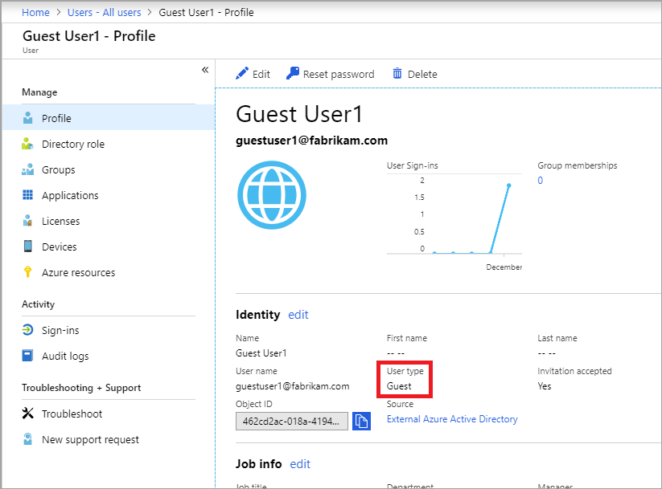

[Guest](https://docs.microsoft.com/azure/active-directory/b2b/user-properties) accounts have limited permissions. Deployment under a guest account will fail.

## Deploy from Azure Marketplace

- [Navigate](https://azuremarketplace.microsoft.com/en-us/marketplace/apps/viacode_consulting-1089577.viacode-itsm-z) to Microsoft Azure Marketplace and find "VIAcode Incident Management System for Azure" offer.

- Press "Get it now" button.
- Select "VIAcode Incident Management System for Azure" software plan and press "Continue".

You will be taken to Azure Portal to complete installation:
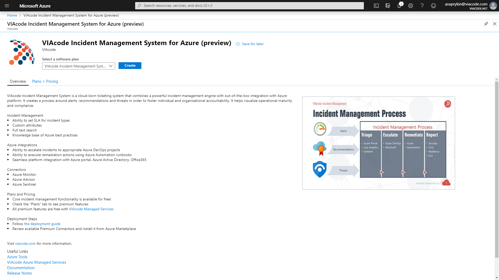

- Make sure "VIAcode Incident Management System for Azure" software plan is selected.
- Press "Create".

### Pricing

The total cost of running VIAcode Incident Management System on Azure is a combination of the selected software plan and cost of the Azure infrastructure on which you will be running it. The Azure infrastructure cost might vary with regards to the region, type of subscription and other discounts.

## Configuration of VIAcode Incident Management System for Azure

After you have selected "VIAcode Incident Management System for Azure" software plan you need to configure it.

## Basics

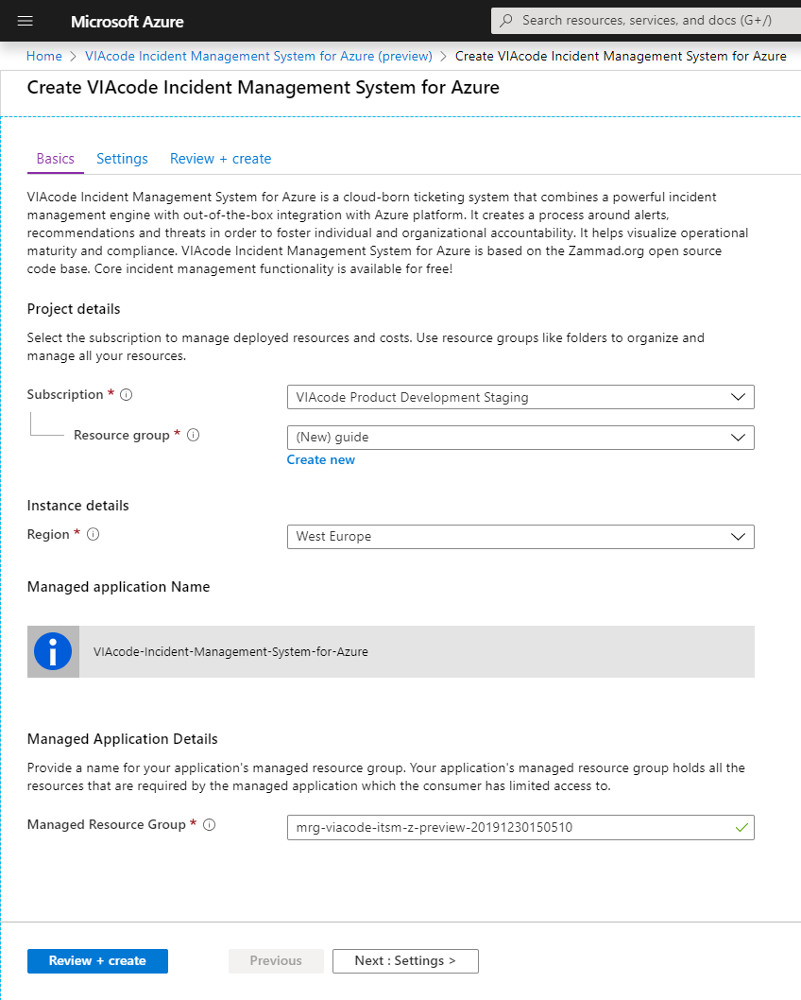

- Choose a subscription to deploy the management application.
- Create a new Resource Group.
- Select a region.
- Provide a name for your application's managed resource group.
- Press "Next : Settings >" button.

## Settings

To enable Azure AD Integration you have to specify Azure AD Application Registration ID and Secret. To create a new App registration see [Steps to create a new App registration in Azure AD](#steps-to-create-a-new-app-registration-in-azure-ad).

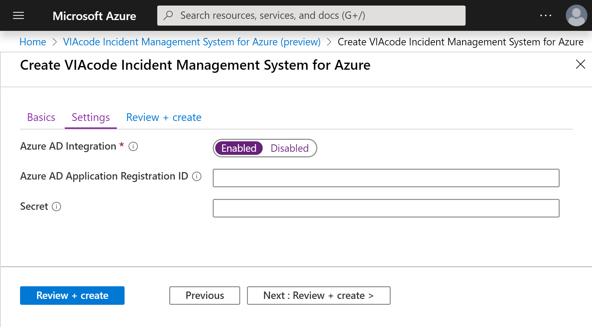

- Either "Enable" Azure AD integration or leave it "Disabled".
- Set Azure AD Application Registration ID.
- Set Secret.
- Press "Next : Review + create >" button.

### Purpose of an App registration

It is used to integrate VIAcode Incident Management System for Azure with Azure AD and Office 365.
Using Azure App, we can generate the token to authenticate the application.
When Azure App is created we can get the Application (client) ID and Secret.
For more information see [Quickstart: Register an application with the Microsoft identity platform.](https://docs.microsoft.com/azure/active-directory/develop/quickstart-register-app)

## Review and create

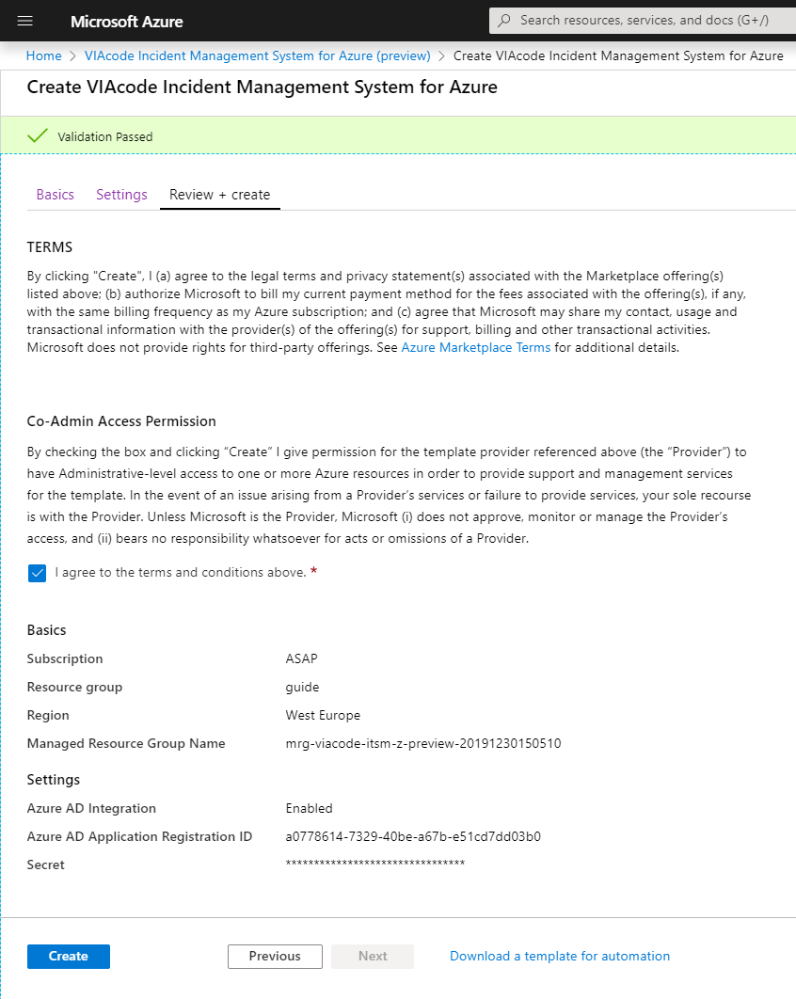

- Agree to the terms and conditions.
- Press "Create" button.

## Redirect URI for Azure AD Integration

When deployment finishes (it usually takes up to 15 minutes to complete) you will have to configure redirect URI to enable Azure Active Directory integration.

**Step 1** In the left-hand navigation pane, select the "Azure Active Directory" service, then select "App registrations" and "[Name of the App registration you used to install VIAcode Incident Management System for Azure]."

**Step 2** Click on "Redirect URIs" link.

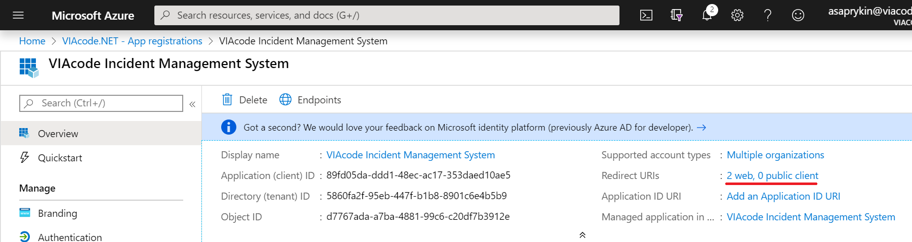

**Step 3**
Configure Redirect URI.

- TYPE - Web.
- REDIRECT URI - https://[App Service Address]/auth/microsoft_office365/callback.

Note: The [App Service Address] can be copied from Parameters and Outputs of the installed managed application.

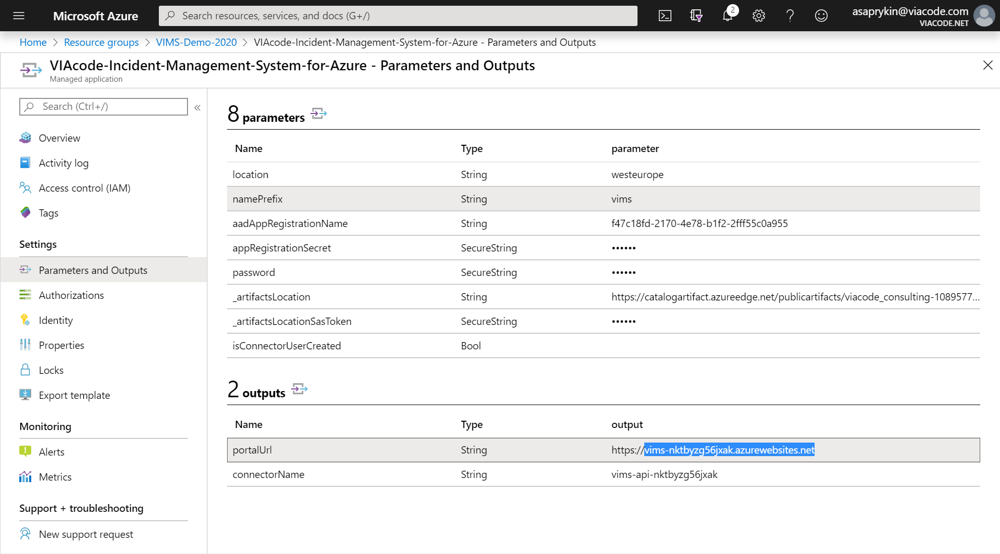

Final string looks like `https:/vims-nktbyzg56jxak.azurewebsites.net/auth/microsoft_office365/callback`.

- Click on "Register."

## First Sign in

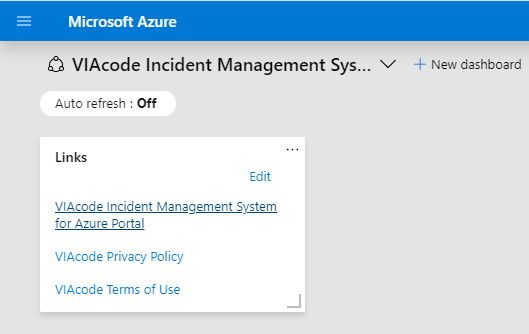

- Open VIAcode Incident Management System for Azure dashboard and click on the link to get to the system.

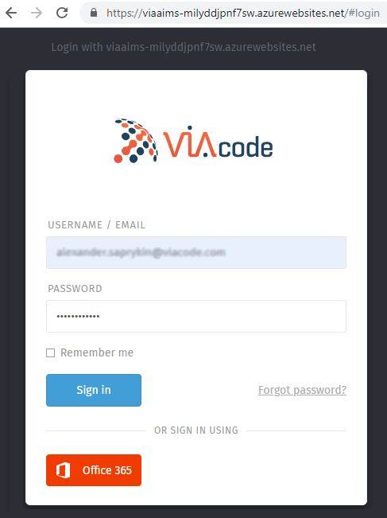

- USERNAME / EMAIL - admin.
- Password - admin.
- "Sign in".

Note: By default VIMS administrator has admin/admin credentials. Please, do not forget to change them after your first Sign in.

### Email configuration

When you Log in to VIAcode Incident Management System for Azure as administrator please configure email notification.

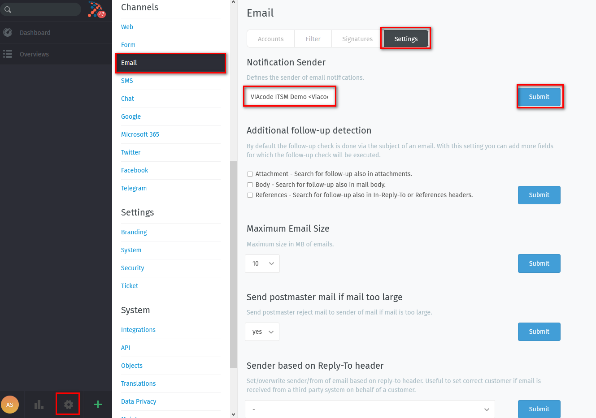

- Click "Cogwheel" in the left bottom corner.
- Click "Email" in Channels section.
- Click "Settings".
- Enter sender name and email in angle brackets in Notification Sender section like it is shown in the screenshot.
- Click "Submit".

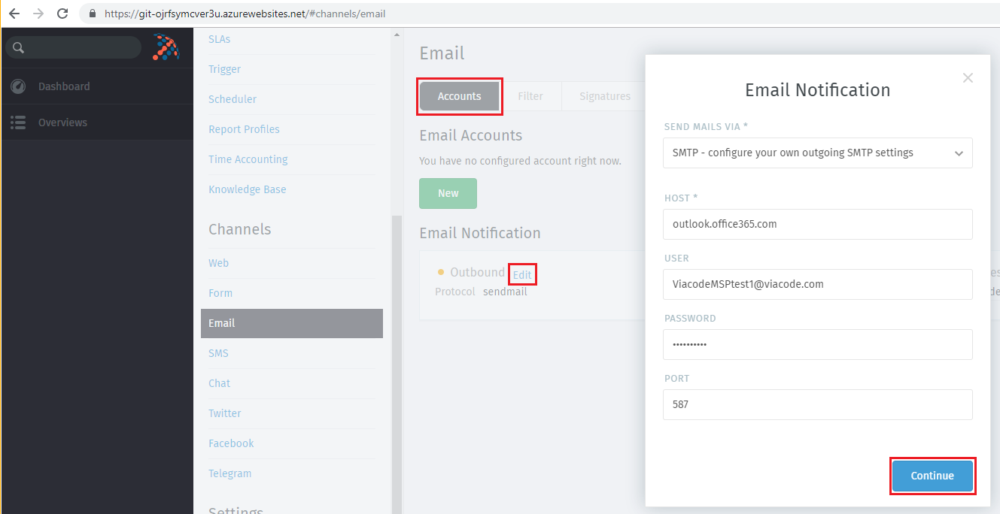

- Click "Accounts".
- Click "Edit" in Email Notification section.
- Select "SMTP - configure your own outgoing SMTP settings" in Send Mails via.
- Fill Host with `outlook.office365.com` for office 365 accounts.
- Fill User with the account you will you use for email notification.
- Fill Password.
- Default port for SMTP is 587.
- Click "Continue" button.

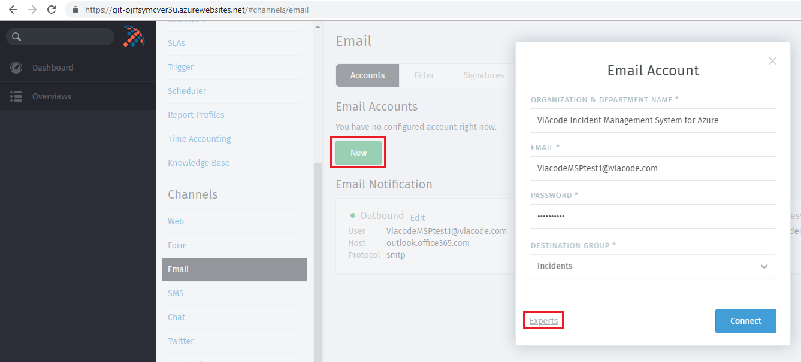

- Click "New" button in Email Accounts section.
- Fill Organization & Department Name.
- Fill Email with the account you will you use for email notification.
- Select "Incidents" in Destination Group.
- Click "Experts" link.

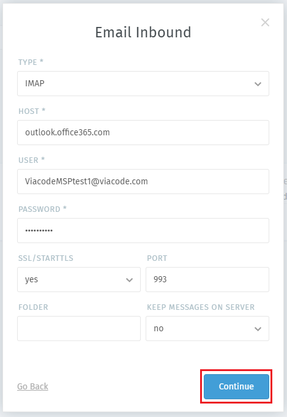

- Select "IMAP" Type.
- Fill Host with `outlook.office365.com` for office 365 accounts.
- Fill User with the account you will you use for email notification.
- Fill Password.
- Default port for IMAP is 993.
- Click "Continue" button.

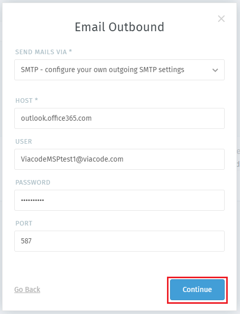

- Check settings.
- Default port for SMTP is 587.
- Click "Continue" button.

Now, when email configuration is complete, make sure Incoming Group has email configured.

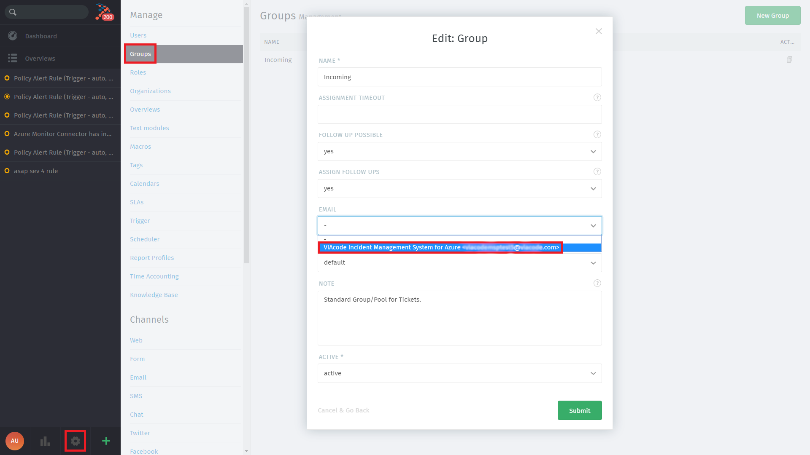

- Click "Cogwheel" in the left bottom corner.
- Click "Groups".
- Click "Incoming".
- Click "Email" and select the Notification Sender you have configured.

#### Notes

Email configuration is required for enabling following functionality:

- Send system account notifications - signup, password reset, password change.
- Register incoming emails as tickets (incoming mail).
- Send notifications about new tickets to the agents, send reminders.
- Use triggers to inform clients about ticket creation, status changes.
- Agent communication with clients by email (using built in web or regular mail client).

It is important to note that after deployment, by default, email profiles are not created. Client has to set up email for VIAcode Incident Management System for Azure manually.

In general, VIAcode Incident Management System for Azure best practice is to create new dedicated empty mail account in company mail system. VIAcode Incident Management System for Azure usually can auto-detect settings, so nothing apart email and password is required.

- Google blocks access to the email from non-google devices by default, so you have to adjust security settings.
- Do not add your work email, VIAcode Incident Management System for Azure will register all emails there and send notification response to each.
- Do not use shared mailbox in Office 365, VIAcode Incident Management System for Azure can not log into it.
- Do not use mailbox that forwards mails, VIAcode Incident Management System for Azure will be unable to read its own test email.

For current email set up documentation see [e-mail](https://zammad-admin-documentation.readthedocs.io/en/latest/channels-email.html).

### Enable Azure AD Integration after installation

To Sign in using Office 365 account after you installed VIAcode Incident Management System for Azure with AD Integration disabled follow these steps:

- Enable HTTPS in System - Base and Make sure Fully Qualified Domain Name is identical to your real URL.

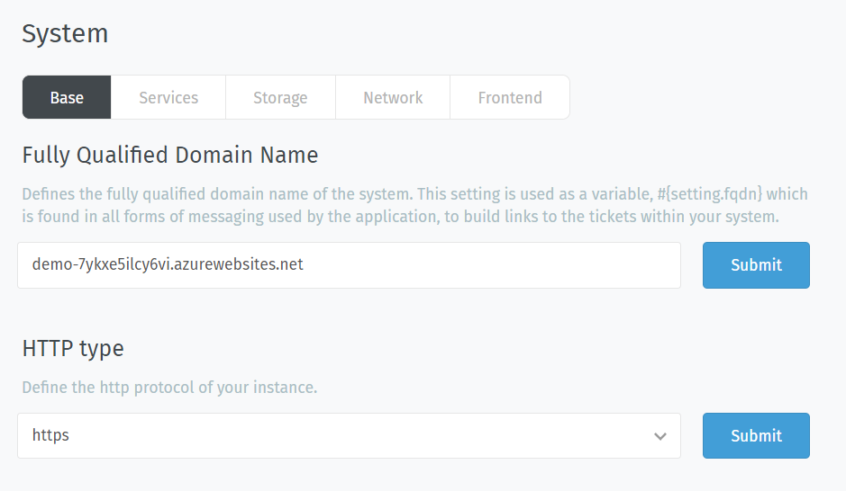

- Select Security - Third-party Applications and enable checkbox Authentication via Office 365, then fill App ID and App Secret according to created application.

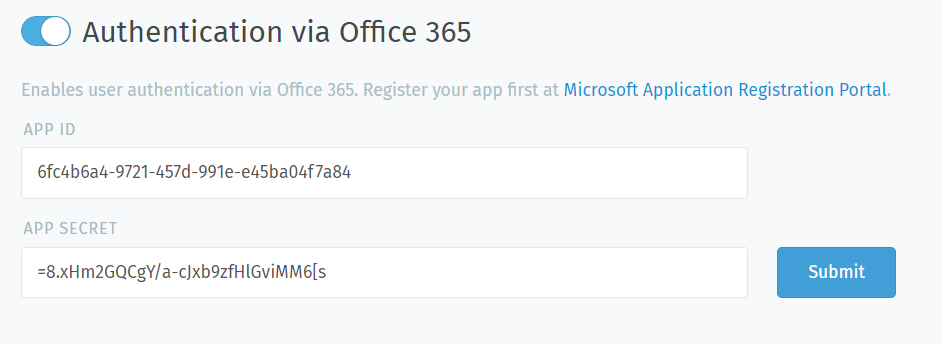

## Additional information

## Steps to create a new App registration in Azure AD

Follow the below-listed steps to register the application.

**Step 1**
Log in to the Azure Portal using your Azure account.
URL - <https://portal.azure.com/>.

**Step 2**
In the left-hand navigation pane, select the "Azure Active Directory" service, and then select" App registrations" > "New registration."

**Step 3**
When the Register an application page appears, enter your application's registration information:

- Name: Enter a meaningful application name that will be displayed to users of the app. (VIAcode Incident Management System for Azure.)
- Supported account types: Select which accounts you would like your application to support. (Accounts in any organizational directory (Any Azure AD directory - Multitenant) and personal Microsoft accounts (e.g. Skype, Xbox)).
- Redirect URI (optional): Leave it for now. It should be specified later when the managed application is installed.
- "Register."

**Step 4**
In the menu blade select "Certificates & secrets" > "New client secret."

**Step 5**
When the Add a client secret page appears, specify Description and Expiration period.

**Step 6**
Copy the secret to clipboard.
Use it as Secret in Create VIAcode Incident Management System for Azure wizard.

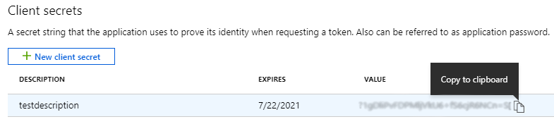

**Step 7**
Navigate to the overview of the App registration and copy Application (client) ID.  
Use it as Azure AD Application Registration ID in Create VIAcode Incident Management System for Azure wizard.

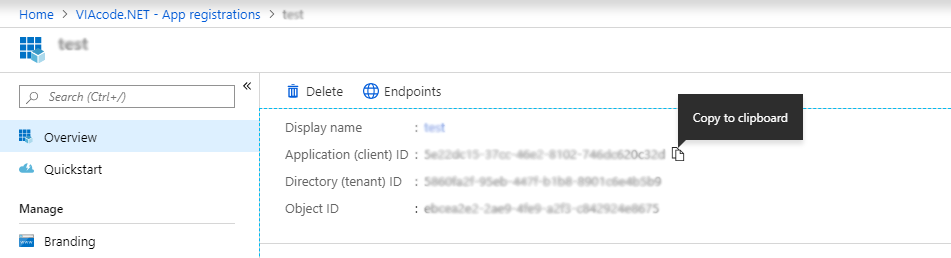

**Step 8**
Configure App registration authentication.

Go to Authentication blade.
Switch the radio button under 'Supported account types' to Multitenant:

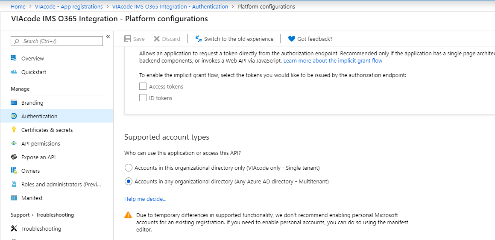